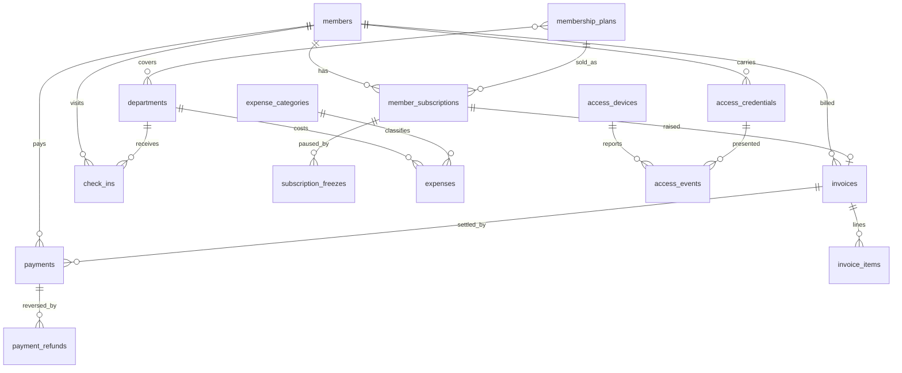

# Domain model

All domain tables use uuid primary keys; staff FKs point at bigint `users`.
Money is integer paisa everywhere (NPR × 100). No column stores rupees.

## Table dictionary (key columns)

- **members** — identity (name parts, photo, dob, gender, blood group),
  contact (phone is the primary identifier; unique via form validation
  `withoutTrashed()`), Nepal address (province/district/municipality/ward/tole),
  emergency + guardian contacts, govt ID, medical notes, referral tracking,
  status (`active|frozen|expired|blacklisted`), soft deletes.
- **membership_plans** — `plan_type` (`time_based` with interval unit/count, or
  `session_pack` with session_count + validity_days), price + admission_fee,
  `is_taxable` / `price_includes_tax`, freeze_allowance_days, off-peak window,
  min/max age, availability window. Pivot `department_membership_plan`.
- **member_subscriptions** — price/admission/discount **snapshots** (plan price
  changes never rewrite history), starts/ends, sessions_total/remaining,
  status, `renewed_from_id` chain, created_by.
- **subscription_freezes** — planned window, `days_count`, `lifted_at`.
  Semantics: pause-and-extend; see doc 02.
- **invoices / invoice_items** — fiscal-year-numbered, full money breakdown
  (subtotal, discount, taxable, tax, total, paid, balance), void audit fields;
  items morph to what was sold.
- **payments / payment_refunds** — receipt number, method, gateway/cheque
  fields, `status` workflow (see doc 02), received/verified by + at.
- **access_credentials** — sha256 `identifier_hash` (raw never stored),
  `identifier_hint` (last 4), deposit tracking, revocation audit.
- **check_ins** — member, department, granting subscription, source
  (`front_desk|qr|door_controller`), `was_allowed` + `denial_reason`,
  `session_consumed`.
- **access_events** — append-only raw log of every hardware decision (no
  `updated_at`), keeps unknown-credential attempts too.
- **expenses / expense_categories** — voucher-numbered; `department_id = NULL`
  means shared overhead, allocated pro-rata by revenue in the P&L report.
- **settings** — key/value JSON (org profile, VAT rate, fiscal year, dues
  policy). Cached; access via `Setting::get()/set()`.
- **number_sequences** — race-safe counters locked `FOR UPDATE`; unique
  indexes on the formatted numbers are the backstop.

## Conventions

- Enums are string-backed lowercase snake (`partially_paid`), implementing
  Filament `HasLabel` (and `HasColor` where shown as badges).
- Models: `HasUuids`, `$guarded = []`, casts via `casts(): array`.
- Activity log on Invoice, Payment, PaymentRefund, MemberSubscription,
  Expense, AccessCredential.
